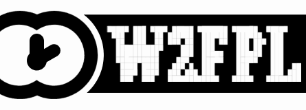

# W2FPL logo and buttons

Use any of these to show that a work is under the W2FPL. Link them to the license, `https://snvrkotics.com/licenses/w2fpl`, with `rel="license"`. Every file is also served from `https://snvrkotics.com/brand/licenses/w2fpl/`.

## Buttons

| | Size | Files |
|---|---|---|
|  | **Normal**, 88 × 31 | [PNG](w2fpl-88x31.png) · [PNG @2x](w2fpl-88x31@2x.png) · [SVG](w2fpl-88x31.svg) |
|  | **Compact**, 80 × 15 | [PNG](w2fpl-80x15.png) · [PNG @2x](w2fpl-80x15@2x.png) · [SVG](w2fpl-80x15.svg) |
|  | **Animated**, 88 × 31 | [GIF](w2fpl-88x31.gif) |

```html
<!-- Normal -->
<a href="https://snvrkotics.com/licenses/w2fpl" rel="license"></a>

<!-- Compact -->
<a href="https://snvrkotics.com/licenses/w2fpl" rel="license"></a>

<!-- Animated -->
<a href="https://snvrkotics.com/licenses/w2fpl" rel="license"></a>
```

In Markdown (a README, for example):

```markdown
[](https://snvrkotics.com/licenses/w2fpl)
```

## Full logo

| | Files |
|---|---|
|  | [SVG](w2fpl.svg) · [890 × 320](w2fpl-890x320.png) · [445 × 160](w2fpl-445x160.png) · [222 × 80](w2fpl-222x80.png) |
|  | Animated: [890 × 320 GIF](w2fpl-890x320.gif) · [445 × 160 GIF](w2fpl-445x160.gif) |

In the animation, the clock holds at two o'clock (when 2), whirls through twelve hours, and lands back on two.

## Icon

| | Files |
|---|---|
|  | [SVG](w2fpl-icon.svg) · [256](w2fpl-icon-256.png) · [128](w2fpl-icon-128.png) · [64](w2fpl-icon-64.png) · [32](w2fpl-icon-32.png) |

The clock alone, with a white face on a transparent square, for favicons and small spaces.

## Use

The logo is under the W2FPL like everything else here, so you can do what you want with it: resize it, recolour it, animate it. Two requests, not conditions. Please don't use it to mark a work that isn't under the W2FPL. And please don't put it on a modified license that isn't called something else; that one is the license's own preamble.

## Rebuilding

`source.svg` is the master artwork. `build.py` makes every other file from it:

```sh
pip install cairosvg pillow numpy scipy
python3 logo/build.py
```
